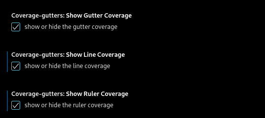

# rust_example_cov

    - These repo show how works rust coverage inside MS Vscode 
    using the expansion coverage-gutters
    - a rocky road  

> [!TIP]
> GITHUB Basic writing and formatting syntax [![alt text][1]](https://docs.github.com/en/get-started/writing-on-github/getting-started-with-writing-and-formatting-on-github/basic-writing-and-formatting-syntax)
<!-- -->  
> [!TIP]
> Comments Inside JSON – Commenting in a JSON File [![alt text][1]](https://www.freecodecamp.org/news/comments-in-json/)
<!-- -->
> [!TIP]
><!--- THis empty line is necessary for correct format -->
> - Image as link text for a markdown link [![alt text][1]](https://meta.stackexchange.com/questions/2133/whats-the-recommended-syntax-for-an-image-with-a-link)
>
> - Whats the recommended syntax for an image with a link? [![alt text][1]][2]
>
> ```
> [![alt text][1]](https://stackoverflow.com/questions/22697688/how-to-cat-eof-a-file-containing-code)
> ```
<!--
[1]: ./img/link_symbol.svg
-->
[2]: https://meta.stackexchange.com/questions/2133/whats-the-recommended-syntax-for-an-image-with-a-link
><!--- THis empty line is necessary for correct format -->
<!-- -->

<!-- 
Markdown Preview Github Styling
GitHub Markdown Preview /w markdown list and other add ones
-->

## Start Date of project

```bash <!-- markdownlint-disable-line code-block-style -->
$ date
Tue May  6 09:30:59 AM CEST 2025
```

## OS-Version

```bash <!-- markdownlint-disable-line code-block-style -->
$ uname -a
Linux debian 6.1.0-28-amd64 #1 SMP PREEMPT_DYNAMIC Debian 6.1.119-1 (2024-11-22) x86_64 GNU/Linux
```

## Create for your own project a project folder in the Linux console (terminal ,bash shell), e.g. in your your own home directory, and then open this folder as a new project in the MS VSCODE program

```bash <!-- markdownlint-disable-line code-block-style -->
# cd && mkdir <project_name folder> && cd $_
# command 'cd' change to home folder from logged in user
cd && mkdir rust-example-cov && cd $_ 
```
<!-- -->
>[!TIP]
> Don't forget to save your project on GitHub - saves you serious headaches
<!-- -->
## Init a new rust based project inside the previously generated folder
<!-- -->
```bash <!-- markdownlint-disable-line code-block-style -->
touch README.md \
&& ln -s README.md README \
&& cargo init "." \
&& cargo add rustfmt \
&& rustup component add rustfmt \
&& mkdir examples \
&& cp src/main.rs examples/example.rs \
&& sed -i -e 's/world/example/g' examples/example.rs \
&& rustup  show \
&& rustup  check \
&& rustup toolchain uninstall stable \
&& rustup toolchain install stable \
&& rustup update  --force \
&& rustup show \
&& mkdir tests
```
<!-- -->
>[!TIP]
> How to cat ```<<EOF>>``` a file containing code
> Test link image for a Markdown link text [![alt text][1]](https://stackoverflow.com/questions/22697688/how-to-cat-eof-a-file-containing-code)
>
><!--- THis empty line inside the block is necessary for correct format -->
<!-- -->
> [!NOTE]
> Run the bash script for generate the testcase inside a normal terminal - not MS VSCODE terminal
><!--- THis empty line is necessary for correct format -->
<!-- -->
> [!TIP]
> Difference between Terminal, Shell and Bash [![alt text][1]](https://medium.com/@krish.raghuram/terminal-shell-and-bash-3e76218c8865)
>
> - The ***terminal*** is the GUI window that you see
> on the screen. It takes commands and shows output.
>
> - The **shell** is the software that interprets and
> executes the various commands that we type in the
> terminal.
>
> - The ***Bash*** (Bourne-again SHell) Shell is a particular shell.
> It stands > for Bourne Again Shell. Some other examples of shell
> are
>
>   - zsh
>
>     Zsh is a shell designed for interactive
>     use, although it is also a powerful
>     scripting language
>
> - bash
>     bourne shell default shell for most
>     Linux/Unix based system
>
> - csh(c shell)
> - tcsh(turbo c shell)
>
> ***CLI(Command Line Interface)*** refers to a user interface in
> computers where users type in commands and see the results
> printed on the screen.

## Replace /src/main.rs generate from command ```cargo init``` with follow testcase

```bash <!-- markdownlint-disable-line code-block-style -->
cat << EOF >> ./src/main.rs
fn main() {
    println!("Dummy fn main!");
}

// prettier-ignore
pub fn answer() -> u32 {
    // for coverage is a instruction necessary
    42 + 0
}

// prettier-ignore
pub fn not_tested() -> u32 {
    // for coverage is a instruction necessary
    43 + 0
}

// prettier-ignore
pub fn greater_than_5(num: u32) -> u32 {
    if num > 5 {
        1
    }else {
        0
    }
}

#[allow(dead_code)]
// prettier-ignore
fn smaller_than_5(num: u32) -> u32 {
    if num < 5 {
        1
    } else {
        0
    }
}

#[cfg(test)]
mod tests {
  use super::*;

  #[test]
  fn test_answer() {
    assert_eq!(answer(), 42);
  }

  #[test]
  fn test_not_tested() {
    assert_eq!(not_tested(), 43);
  }

  #[test]
    fn test_greater_than_5() {
    assert_eq!(greater_than_5(6), 1
);
  }

  #[test]
    fn test_no_greater_than_5() {
    assert_eq!(greater_than_5(4), 0);
  }
}
EOF 
```

## GNU sed - sed, a stream editor [![alt text][1]](https://www.gnu.org/software/sed/manual/sed.html)

> [!TIP]
> Good Instruction in GNU sed - A Practical Guide to GNU sed With Examples [![alt text][1]](https://thevaluable.dev/sed-cli-practical-guide-examples/)

### Inserting an additional command line to call a function in the file [![alt text][1]](https://stackoverflow.com/questions/15559359/insert-line-after-match-using-sed)

### sed option - Command option for the command itself [![alt text][1]](https://linux.die.net/man/1/sed)

- -i &rarr; replace insert the file
  - option **-i** sed writes output to standard output. Use -i to edit files in-place instead of printing to standard output. See also the W and s///w commands for writing output to other files. The following command modifies file.txt and does not produce any output:

### regular expression flags - Inside the regular expression [![alt text][1]](https://www.codeguage.com/courses/regexp/flags)

- /a &rarr; append to the match found by regex
- \t &rarr; add a tabulator to line

```bash <!-- markdownlint-disable-line code-block-style -->
sed -i  '/println!("Hello, world!");/a\
\tprintln!("{} {} ", answer(), not_tested());' src/main.rs
```

> [!Note]
> Insert line after match using sed [![alt text][1]](https://stackoverflow.com/questions/15559359/insert-line-after-match-using-sed)
<!-- --><!--- THis empty line inside the block is necessary for correct format -->
> [!NOTE]
> When should I use \A in a regex? [![alt text][1]](https://stackoverflow.com/questions/2650549/when-should-i-use-a-in-a-regex)
><!--- THis empty line inside the block is necessary for correct format -->

## Run all UNIT test of project

```bash <!-- markdownlint-disable-line code-block-style -->
cargo test
```

## Install extension cargo-tarpaulin [![alt text][1]](https://crates.io/crates/cargo-tarpaulin)

```bash <!-- markdownlint-disable-line code-block-style -->
cargo install cargo-tarpaulin
```
<!--- THis empty line is necessary for correct format -->
> [!NOTE]
> How do I list all of the RUST packages
> are installed **globally** with the
> command **cargo install**?[![alt text][1]](https://stackoverflow.com/questions/60857222/how-do-i-list-all-of-the-packages-ive-installed-globally-with-cargo-install)
>
> ```bash<!-- markdownlint-disable-line code-block-style -->
> cargo install --list
> ```
><!--- THis empty line inside the block is necessary for correct format -->
&nbsp;

### Run cargo-tarpaulin inside this project

```bash<!-- markdownlint-disable-line code-block-style -->
cargo tarpaulin --out Lcov
```
<!--- THis empty line inside the block is necessary for correct format -->
&nbsp;

## Set output format for MS VSCODE extension coverage-gutters [![alt text][1]](https://marketplace.visualstudio.com/items/?itemName=ryanluker.vscode-coverage-gutters)

- --out Lcov
- and more for other extensions

### Speed up of the program flow through the features

- --target-dir $PWD/target/tarpaulin
- --skip-clean
- --ignore-tests

```bash<!-- markdownlint-disable-line code-block-style -->
# run /w --target-dir , --ignore-tests and --skip-clean
cargo tarpaulin --ignore-tests --target-dir $PWD/target/tarpaulin --skip-clean --out Lcov
```
<!-- --><!--- THis empty line inside the block is necessary for correct format -->
&nbsp;

> [!NOTE]
> The command will generate two files
>
> 1. lcov.info
> 2. rust-example-cov/target/tarpaulin/rust-example-cov-coverage.json
<!-- --><!--- This empty line between the blocks is required for the correct format so that they are displayed separately -->
> [!TIP]
>
> - How To Take A Screenshot under Linux | Computing [![alt text][1]](https://www.maths.cam.ac.uk/computing/linux/X/screenshots#:~:text=Use%20the%20shortcut%20key%20PrintScreen,will%20capture%20the%20whole%20desktop.)
>
>   - Use the shortcut key [PrintScreen] find on your Keyboard to capture the whole desktop
>   - To capture the current windows or select the area [Alt]+[PrintScreen]
>

### Enable Show Line Coverage in MS VSCode

- Edit the settings of the MS VSCode extension **coverage-gutters**
- Select for that the settings (gear) icon in the extension overview
- Select **ALL** Boxes extension option show line coverage  <!-- [see img](./img/coverage-gutters-show-line-coverage.png) - see image -->
- 
<!-- --><!--- THis empty line inside the block is necessary for correct format -->

### rustfmt

- is rustfmt already installed with which version
  
  ```bash <!-- markdownlint-disable-line code-block-style -->
   rustfmt -V
        rustfmt 1.8.0-stable (05f9846f89 2025-03-31)
  ```

- install rustfmt local
  
```bash <!-- markdownlint-disable-line code-block-style -->
rustup component add rustfmt
```

- delete rustfmt local
  
  ```bash <!-- markdownlint-disable-line code-block-style -->
  # list where is rustfmt already installed - system wide - user /home folder
  $ ls -l ~/.cargo/bin
  
  # remove standard way
  $ rustup component remove rustfmt

  # FORCE delete binary rustfmt
  $ rm -rf  ~/.cargo/bin/rustfmt

  # clean up rustup registry - same how standard way
  $ rustup component remove rustfmt
  ```

  > [!NOTE]
  > If rustfmt is not installed but it is called, the following error message appears
  >
  >```text <!-- markdownlint-disable-line code-block-style -->
  > [Error - 9:38:34 AM] Request textDocument/formatting failed.
  > Message: Failed to spawn cd "/home/trapapa/rust-example-cov/src" 
  > && "rustfmt" "--edition" "2024"
  > Code: -32603 
  > ```
  <!-- --><!--- THis empty line inside the block is necessary for correct format -->

### [Prettier-Code Formatter Rust](https://github.com/jinxdash/prettier-plugin-rust)

> [!NOTE]
> [Extension Prettier - Code Formatter - How to ignore things - prettier-ignore](https://github.com/jinxdash/prettier-plugin-rust)
>
> - Add // prettier-ignore above instruction it
> - **DOESN'T WORK FOR WHATEVER REASON**Add #![rustfmt::skip] inside blocks or files
> <!-- --><!--- THis empty line inside the block is necessary for correct format -->
&nbsp;
> [!IMPORTANT]
> **TEST FIRST** YOU HAVE THE CORRECT EXTENSION INSTALLED
> [The correct version of Prettier-Code Formatter for RUST](img/Prettier-Code_Formatter_Rust.png)
> indicates missing/incorrect version
> [Prettier-Code Formatter: Can Not Format Rust Files](img/Prettier-Code_Formatter_Can_Not_Rust_Files.png)
> [The wrong version of Prettier-Code Formatter](img/Prettier-Code_Formatter.png)
<!-- --><!--- THis empty line inside the block is necessary for correct format -->
&nbsp;

<!-- --><!--- THis empty line inside the block is necessary for correct format -->
&nbsp;

## Markdown Marker - works on GitHub

> [!NOTE]
> Useful information that users should know, even when skimming content
<!-- -->
> [!TIP]
> Helpful advice for doing things better or more easily
<!-- -->
> [!IMPORTANT]
> Key information users need to know to achieve their goal
<!-- -->
> [!WARNING]
> Urgent info that needs immediate user attention to avoid problems
<!-- -->
> [!CAUTION]
> Advises about risks or negative outcomes of certain actions
&rarr;

## Markdown arrow - works on GitHub

- Up arrow (↑): `&uarr;`
- Down arrow (↓): `&darr;`
- Left arrow (←): `&larr;`
- Right arrow (→): `&rarr;`
- Double headed arrow (↔): `&harr;`

## Another  good-looking notification or warning box in Github Flavoured Markdown?[![alt text][1]](https://stackoverflow.com/questions/58737436/how-to-create-a-good-looking-notification-or-warning-box-in-github-flavoured-mar)

| :memo:        | Take note of this       |
|---------------|:------------------------|

| :point_up:    | Remember to not forget! |
|---------------|:------------------------|

| :link:    | Link to click! |
|---------------|:------------------------|

| :warning: WARNING          |
|:---------------------------|
| I should warn you ...      |

| :boom: DANGER              |
|:---------------------------|
| Will explode when clicked! |

## Creative Commons BY-SA Icon [alt text][1]]("https://i.creativecommons.org/l/by-sa/4.0/80x15.png">


<!-- Link sign - Don't Found a better way :-( - You know a better method? - send me a email -->
[1]: ./img/link_symbol.svg
  